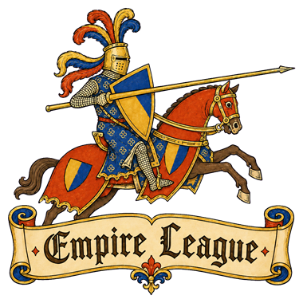

# Empire League

<p align="center">
  
</p>

Empire League is an open-source community desktop client and matchmaker for
Age of Empires II: Definitive Edition. It provides ranked 1v1 and team
matchmaking, curated map pools, seasonal leagues, parties, social features,
custom games, and automated tournaments in a single Windows app.

The client coordinates private AoE2 lobbies through the game's standard user
interface, while the matchmaker handles queues, player ratings, and social
services. Recorded games are used to verify match results before ratings and
leaderboards are updated. Empire League is an independent community project
and is not affiliated with Microsoft or World's Edge.

## Architecture

- The Windows Electron client is built locally and published to a generic
  `electron-updater` feed under `/updates/windows`.
- Packaged clients check the update feed three seconds after startup and every
  ten minutes while running. Updates download in the background and present a
  mandatory, themed restart prompt when ready.
- Production clients connect to the public matchmaker hostname. Development
  uses `VITE_MATCHMAKER_URL`, falling back to `http://127.0.0.1:4317`.
- The matchmaker runs as a systemd service behind Nginx and stores persistent
  state in MariaDB.

## Deployment

See [DEPLOYMENT.md](DEPLOYMENT.md) for website, Windows client, auto-updater,
and matchmaker deployment instructions.

## Local development

Start the local matchmaker and Electron development client in separate shells:

```powershell
npm.cmd run matchmaker
npm.cmd run dev
```

To point development at another non-production matchmaker, set
`VITE_MATCHMAKER_URL` in the local environment. Packaged production builds use
the production matchmaker configured in the application source.

Other useful commands:

```powershell
npm.cmd run package
npm.cmd run test:maps
npm.cmd run test:civilizations
npm.cmd run test:replays
npm.cmd run test:replay-results
npm.cmd run test:ratings
```

## License

Original Empire League source code and documentation are available under the
[MIT License](LICENSE). The license does not grant rights to the Empire League
name or logos, or to Microsoft, Age of Empires, and other third-party assets.
See [THIRD_PARTY_NOTICES.md](THIRD_PARTY_NOTICES.md) for details.
